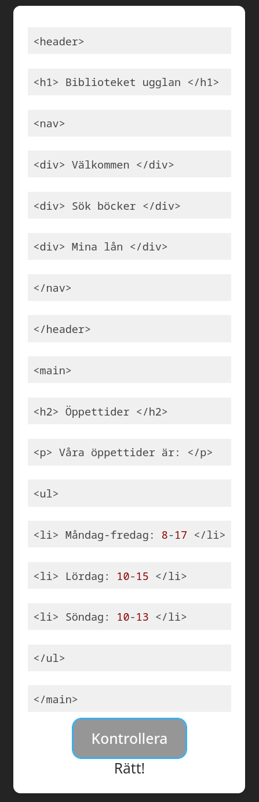

# tapht25d-03_06_webben

## Exercise 1a: Which html elements are used on the w3schools website?

- html
- head
- script
- link
- style
- title
- meta
- body
- div
- noscript
- h1
- br
- hr
- h2
- p
- ul
- li


## Exercise 1b: Which html elements are used on the Wikipedia page on Thutmose II?

- html
- head
- body
- div
- style
- p
- a
- main
- header
- table
- h2
- h3
- h4s
- span
- figure
- b
- i 
- sup
- span
- blockquote
- link
- footer

## Exercise 1c: Quiz - find the correct order for the code elements



## Exercise 1d: Find as many erros as pooible in the followingHTML
``` html
<main>
<section>
<h1> Find the error
<p> This is an example of an HTML file. It contains several errors.

<p> Can you find them all? </p>
</p>
</main>
```

1. No closing ```</section>``` tag
2. No closing ```</h1>``` tag
3. The ```<p>``` tag on line 4 is not closed before the next ```<p>``` tag is opened (on line 6)
4. No src (url) provided for ``````
5. Text after ```<img``` should be preceded by "alt=" and enclosed with quotes  
